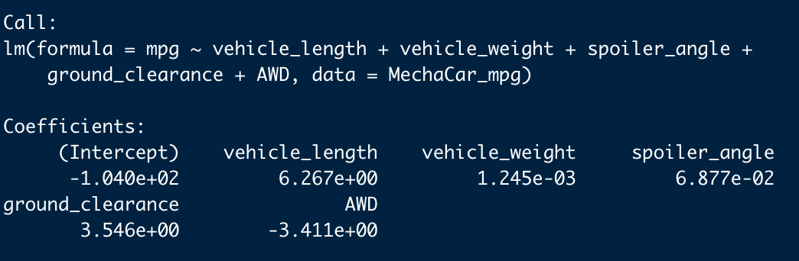
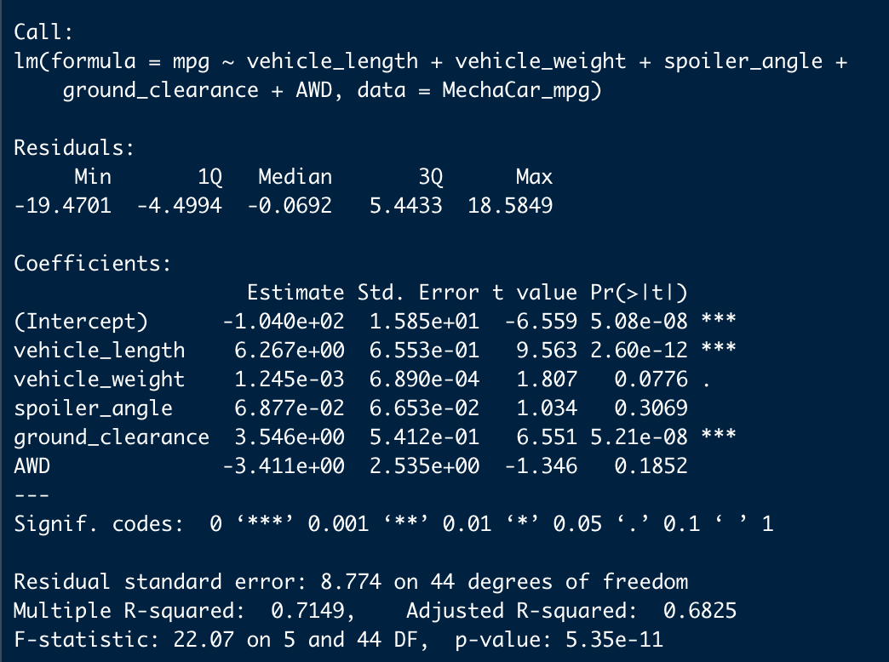
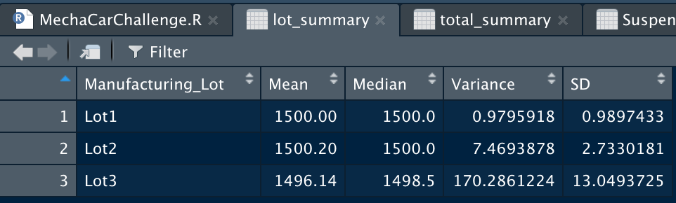

# MechaCar_Statistical_Analysis

## Linear Regression to Predict MPG

In performing a linear regression about the MechaCar_mpg.csv file, we find that the following factors play an impact in the amount of variance to the MPG values in the dataset:

- Vehicle Length
- Ground Clearance

These two factors provide enough of a positive slope and have a low enough significance level within our model such that our linear model is considered to have a non-zero positive slope. Vehicle length and Ground clearance have beta value of 6.267 and 3.546 respectively with a miniscule p-value for both variables.

The r^2 value about this regression model is .7149, which makes for a strong enough coefficient of determination r-value of .8455 that indicates this model makes a good approximation of real-world data points. Images of our regression results and summary are below.

#### Linear Regression

#### Linear Regression Summary

## Summary Statistics on Suspension Coils

Upon review of our Suspension Coil data, we discover that the variance about the suspension coils overall satisfies the  condition that Suspension Coil PSI variance should not exceed 100. 

#### Total Suspension Coil Summary Data

#### Total Suspension Coil Summary Data by Lot

However, when we look at the individual lots, we discover that Lot3 houses Suspension Coils that greatly exceed that parameter while lots 1 and 2 remain very well within the defined condition. With that, lot 3 Suspension Coils should be rejected given this discovery of the excessive variance. 
