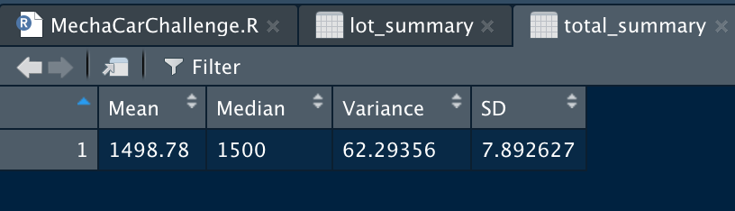

# MechaCar_Statistical_Analysis

## Linear Regression to Predict MPG

In performing a linear regression about the MechaCar_mpg.csv file, we find that the following factors play an impact in the amount of variance to the MPG values in the dataset:

- Vehicle Length
- Ground Clearance

These two factors provide enough of a positive slope and have a low enough significance level within our model such that our linear model is considered to have a non-zero positive slope. Vehicle length and Ground clearance have beta value of 6.267 and 3.546 respectively with a miniscule p-value for both variables.

The r^2 value about this regression model is .7149, which makes for a strong enough coefficient of determination r-value of .8455 that indicates this model makes a good approximation of real-world data points. Images of our regression results and summary are below.

#### Linear Regression

#### Linear Regression Summary

## Summary Statistics on Suspension Coils

Upon review of our Suspension Coil data, we discover that the variance about the suspension coils overall satisfies the  condition that Suspension Coil PSI variance should not exceed 100. 

#### Total Suspension Coil Summary Data

#### Total Suspension Coil Summary Data by Lot

However, when we look at the individual lots, we discover that Lot3 houses Suspension Coils that greatly exceed that parameter while lots 1 and 2 remain very well within the defined condition. With that, lot 3 Suspension Coils should be rejected given this discovery of the excessive variance. 

## T-Tests on Suspension Coils

When we run T-Tests on our Suspension Coils here's what we were able to discover:

- The sample of 150 Suspension Coils overall is not statistically different from the population mean of 1500 pounds per square inch (PSI). About the entire sample, we produced a p-value of 0.06028, which does not fall within the p = 0.05 significance level.

- When we looked at our three lots however, lots 1 and 2 were not statistically different from the 1500 PSI population mean while lot 3 was! In performing a t-test about lot 3 alone, we produced a p-value of 0.04168, a value which falls within the p = 0.05 significance level. This lot in particular is statistically different from the population and should not be used in  MechaCar production. 

Please review the snippets of our T-Test results for validation.

#### T-Test results about entire set of Suspension Coils

#### T-Test results about Lot3 Data

## Study Design: MechaCar vs Competition

With our MechaCar and the shockwaves that we want this vehicle to make within the industry, what points can we emphasize to show that our MechaCar stands out from the competition? 

We have a ton of designs that we have looked at to determine what variables, when optimized, can proivde the best MPG for our vehichle. These days, cars that use ICE engines also use gas and we want to show our consumers that while you can have performance within our MechaCar, it can also save you gas compared to the competition. 

To compare between the MechaCar and the competition, I recommend that we use a Two-Sample T-Test to compare average MPG between the two vehicle types. Our Null Hypothesis would state that the MechaCar, when compared to the competition has the same or less MPG efficiency when compared to the competition (Null: MechaCar MPG <= Competitor MPG). Our alternative hypothesis would state that the MechaCar does have more, or higher MPG efficiency then the competition (Alt: MechaCar MPG > Competitor MPG). 

In executing the test to gain data, we would have to get a normal sample size of the MechaCars and the competitor's (at least 30 cars each) and subject them to a driving test where the driving procedure between both vehicles are the same. We'll have the vehicles drive a 5 mile stretch of road and observe the same driving style between each vehicle as it drives it's length down the road. We then record the MPG efficiency of each run between the two sample sets then run our test from there. 
